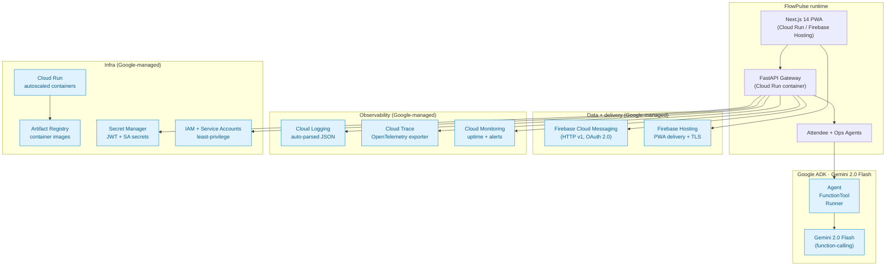
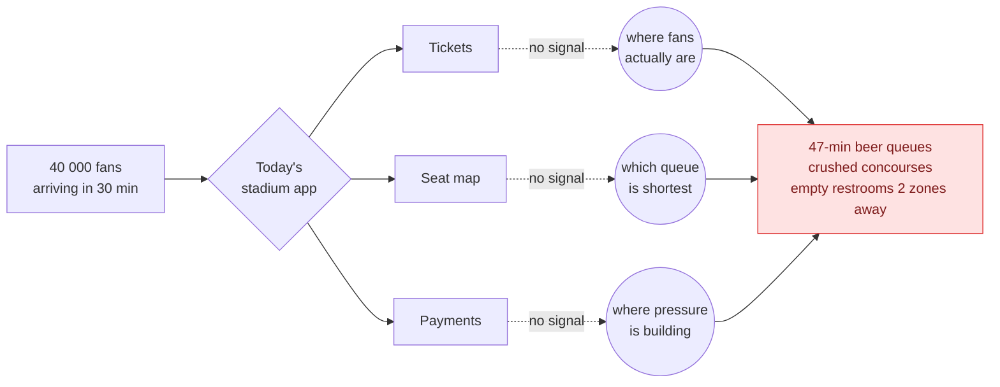
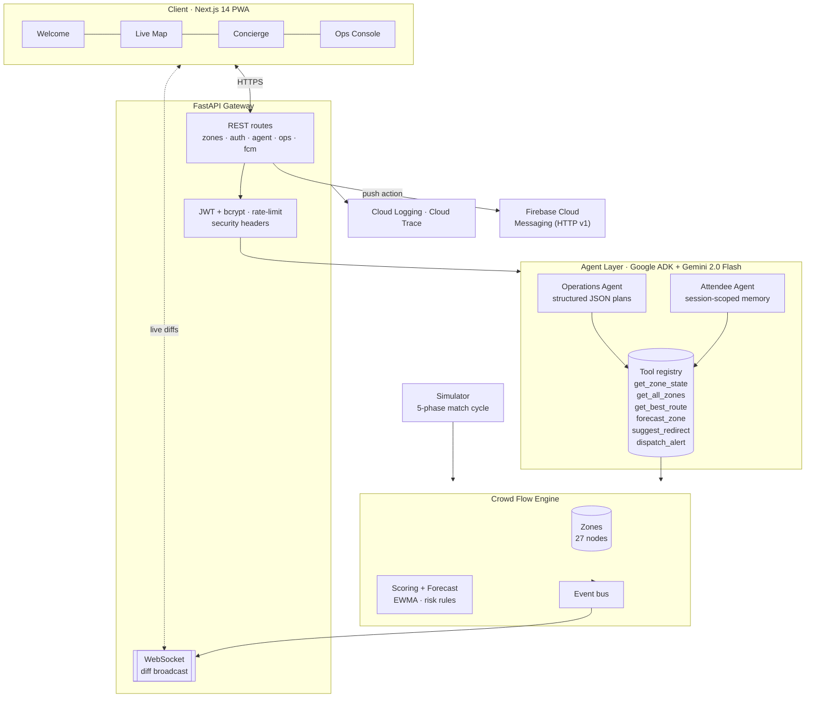
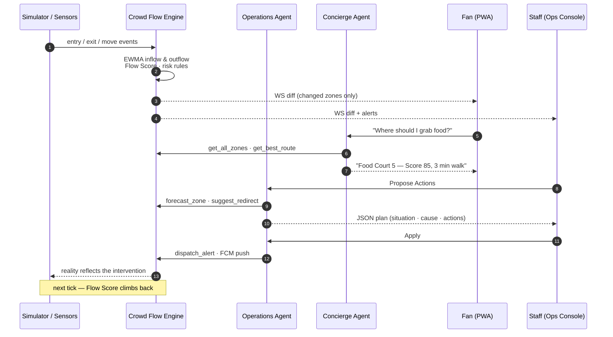
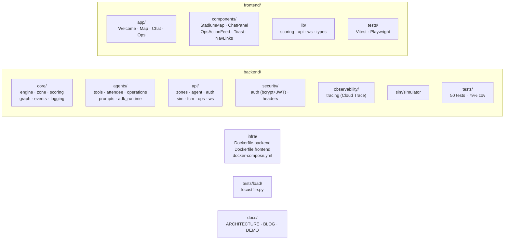

<div align="center">

# FlowPulse

### The nervous system for live venues — built on Google Cloud.

**Sense · Decide · Influence · Optimize**


</div>

---

## What it is

FlowPulse treats a stadium as a **flow system, not a container**. Every gate, concourse, food court, restroom and exit is a node in a live graph with a single **Crowd Flow Score** from 0 to 100. Two **Google ADK** agents — a fan **Concierge** and an **Operations** agent powered by **Gemini 2.0 Flash** — turn that live state into grounded recommendations for attendees and concrete actions for staff. **Firebase Cloud Messaging** delivers push notifications, **Cloud Trace** captures end-to-end spans, **Cloud Logging** ingests structured JSON, and **Cloud Run** hosts the whole thing.

Built for IPL, FIFA, and Olympics-scale venues. Runs on a laptop with one command; scales on Google Cloud.

> **Why this is different:** existing stadium apps are ticket wallets. They know who you are and where your seat is — but nothing about where fans actually are, which queues are shortest, or where pressure is building. FlowPulse is the **operating system for the building itself.**

---

## 🟦 Google Cloud at the heart of the system

FlowPulse isn't "an app that uses an API key." It's designed top-to-bottom as a Google-native workload.



### Every Google service, what we use it for, and where it lives in the code

| Service | Purpose in FlowPulse | Source reference |
|---|---|---|
| **Google ADK** (`google-adk`) | Agent runtime — `Agent`, `FunctionTool`, `Runner`, `InMemorySessionService` | [`backend/agents/adk_runtime.py`](backend/agents/adk_runtime.py) |
| **Gemini 2.0 Flash** | Reasoning model for both Attendee + Ops agents; function-calling over live tools | [`backend/agents/attendee_agent.py`](backend/agents/attendee_agent.py), [`operations_agent.py`](backend/agents/operations_agent.py) |
| **Firebase Cloud Messaging (v1)** | Push notifications triggered by Ops `push_notification` action — OAuth 2.0 via service-account, topic-based delivery | [`backend/api/routes_fcm.py`](backend/api/routes_fcm.py) |
| **Cloud Logging** | Every request + tool call + ADK event → single-line JSON on stdout, auto-parsed by GCP into severity + trace linkage | [`backend/core/logging.py`](backend/core/logging.py) |
| **Cloud Trace (via OpenTelemetry)** | End-to-end spans for ADK calls, tool invocations, engine ticks — exported with `CloudTraceSpanExporter` | [`backend/observability/tracing.py`](backend/observability/tracing.py) |
| **Cloud Run** | Stateless container deployment target — both frontend and backend Dockerfiles are Cloud-Run-ready | [`infra/Dockerfile.backend`](infra/Dockerfile.backend), [`infra/Dockerfile.frontend`](infra/Dockerfile.frontend) |
| **Service Accounts + IAM** | Credentials for FCM + Cloud Trace; least-privilege roles (`roles/cloudtrace.agent`, `roles/firebase.messaging`) | `.env` → `GOOGLE_APPLICATION_CREDENTIALS` |
| **Secret Manager** (prod target) | `FLOWPULSE_JWT_SECRET`, `GOOGLE_APPLICATION_CREDENTIALS` sourced via env in dev, Secret Manager in Cloud Run | `.env.example` documents the swap |
| **Artifact Registry** (Cloud Run dep.) | Holds `flowpulse-backend` and `flowpulse-frontend` images | Built from `infra/*.Dockerfile`, pushed via `gcloud run deploy` |

### Grounded-AI discipline — why ADK tools matter

Our agents *never* invent numbers. Every claim in every reply traces back to a **ADK `FunctionTool`** call against the live Crowd Flow Engine. In the UI each tool call is rendered as a citation chip next to the reply, so judges can see the exact data path:

```
"Head to Food Court 5 — Flow Score 85/100, 3 min walk."
[get_all_zones()] [get_best_route()] [engine: google-adk]
```

That discipline is enforced at three layers:

1. **Prompt-level** (`backend/agents/prompts.py`): explicit CRITICAL rules — no guessed locations, no invented scores, no routes without a valid `start`.
2. **Tool-level** (`backend/agents/tools.py`): every tool validates input against the live engine and returns `{"error": ...}` on miss — the model is told never to fabricate around errors.
3. **UI-level** (`frontend/components/ChatPanel.tsx`): the `tool_calls` list from each response is rendered as chips; an answer without chips is visibly ungrounded.

### Deploying to Google Cloud (one flow)

```bash
# 1. Images → Artifact Registry
gcloud artifacts repositories create flowpulse --repository-format=docker --location=asia-south1
gcloud builds submit backend  --tag asia-south1-docker.pkg.dev/$PROJECT/flowpulse/backend
gcloud builds submit frontend --tag asia-south1-docker.pkg.dev/$PROJECT/flowpulse/frontend

# 2. Secrets → Secret Manager
printf "$JWT" | gcloud secrets create flowpulse-jwt --data-file=-

# 3. Deploy → Cloud Run
gcloud run deploy flowpulse-backend \
    --image asia-south1-docker.pkg.dev/$PROJECT/flowpulse/backend \
    --region asia-south1 --allow-unauthenticated \
    --set-secrets FLOWPULSE_JWT_SECRET=flowpulse-jwt:latest \
    --set-env-vars GOOGLE_CLOUD_PROJECT=$PROJECT \
    --service-account flowpulse-runtime@$PROJECT.iam.gserviceaccount.com

# 4. Spans + logs show up automatically in Cloud Trace / Cloud Logging.
```

The backend auto-detects it's on GCP via the metadata server — no env tweak needed once the runtime service account has `roles/cloudtrace.agent` + `roles/firebasemessaging.admin`.

---

## The problem, in one picture



---

## System architecture



---

## The closed loop — how a crowd actually moves



The four loop phases are visible on screen: **Sense → Decide → Influence → Optimize**, repeated every second.

---

## How congestion is actually reduced — four levers

```mermaid
flowchart TB
    HOT(["Hot zone detected"]) --> L1 & L2 & L3 & L4

    L1["<b>1 · Personal routing</b><br/><i>pull model</i><br/>Dijkstra with<br/>density-weighted edges"]
    L2["<b>2 · Broadcast redirect</b><br/><i>push model</i><br/>suggest_redirect<br/>+ FCM push"]
    L3["<b>3 · Capacity actions</b><br/><i>supply side</i><br/>open_gate<br/>dispatch_staff"]
    L4["<b>4 · Pre-emptive forecast</b><br/><i>T minus 30s</i><br/>forecast_zone<br/>risk rule fires early"]

    L1 --> R1["Walk 10% longer<br/>wait ~38% less"]
    L2 --> R2["20-40% of a queue<br/>shifts to greener zone"]
    L3 --> R3["Parallelism up<br/>throughput up"]
    L4 --> R4["Alert before critical<br/>not after"]

    R1 & R2 & R3 & R4 --> OK(["Flow Score climbs"])

    classDef hot fill:#fee2e2,stroke:#dc2626,color:#7f1d1d;
    classDef ok  fill:#dcfce7,stroke:#16a34a,color:#065f46;
    class HOT hot;
    class OK  ok;
```

---

## Repo at a glance



---

## Quick start

```bash
# one-shot launcher — creates .venv, installs deps,
# opens Windows Terminal with Backend + Frontend tabs
start.bat
```

<details>
<summary>Manual setup</summary>

```bash
py -3 -m venv .venv
.venv\Scripts\activate
pip install -r backend/requirements.txt
uvicorn backend.main:app --reload --port 8000

cd frontend
npm install
npm run dev
```

</details>

Open:

| Route | What it is |
|---|---|
| `http://localhost:3000/` | Welcome + how-to-use guide |
| `http://localhost:3000/map` | Live map with flow particles |
| `http://localhost:3000/chat` | Fan concierge chat (Gemini-powered) |
| `http://localhost:3000/ops` | Staff console (`ops` / `ops-demo`) |
| `http://localhost:8000/docs` | OpenAPI explorer |

Environment setup (all optional — demo works dry-run):

| Variable | Google service | How to get |
|---|---|---|
| `GOOGLE_API_KEY` | Gemini via ADK | https://aistudio.google.com/app/apikey |
| `GOOGLE_APPLICATION_CREDENTIALS` | FCM HTTP v1 + Cloud Trace | Firebase → Service accounts → Generate key |
| `GOOGLE_CLOUD_PROJECT` | Cloud Trace target + FCM project | GCP console project ID |
| `FLOWPULSE_JWT_SECRET` | Staff auth (bcrypt + JWT) | `secrets.token_urlsafe(48)` |

---

## Testing

```bash
# backend — 50 tests, coverage threshold 75% (currently 79%)
.venv\Scripts\python.exe -m pytest backend/tests -q

# frontend unit tests
cd frontend && npm test

# end-to-end smoke
cd frontend && npx playwright install chromium && npm run e2e

# load profile (1k-user scenario, HTTP only)
locust -f tests/load/locustfile.py --host=http://localhost:8000
```

---

## Further reading

- [docs/ARCHITECTURE.md](docs/ARCHITECTURE.md) — components, data flow, scaling notes
- [docs/BLOG.md](docs/BLOG.md) — product thesis in long form
- [docs/DEMO.md](docs/DEMO.md) — 5-minute demo script

---

<div align="center">

**MIT · Built for a challenge · Designed for Google Cloud**

</div>
