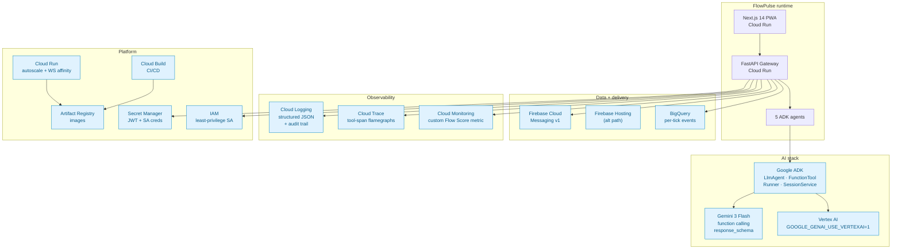
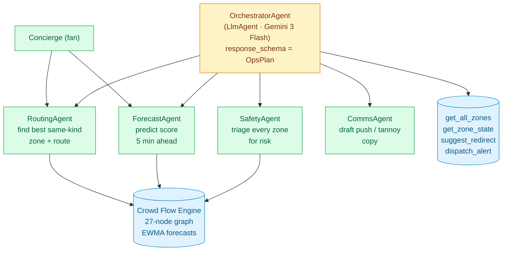
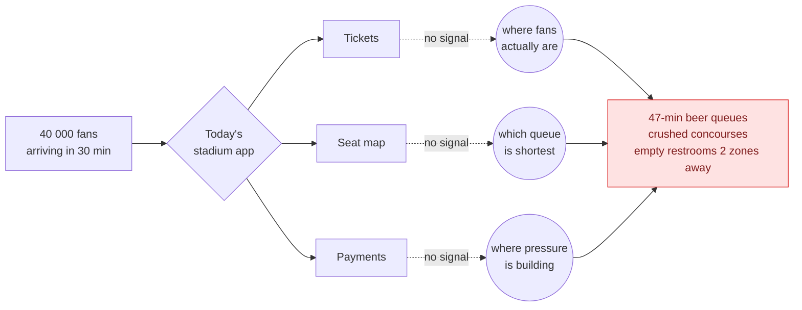
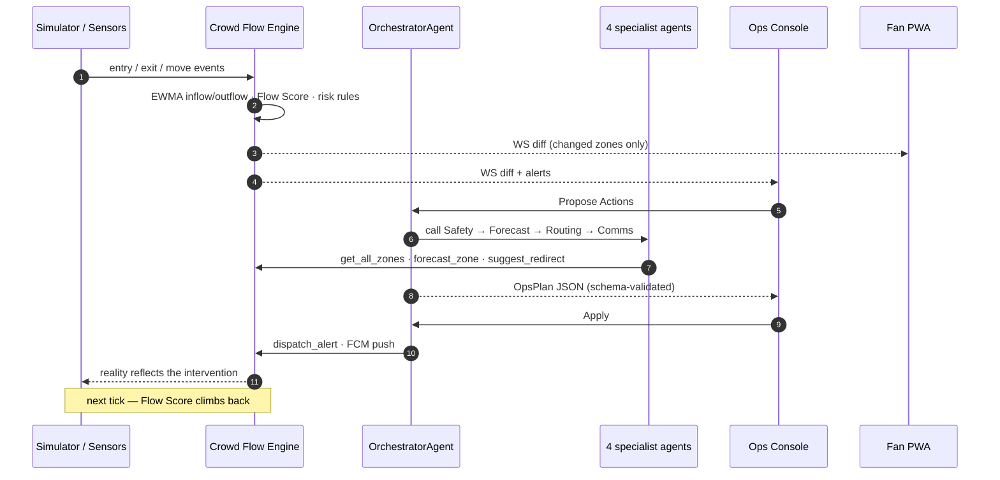
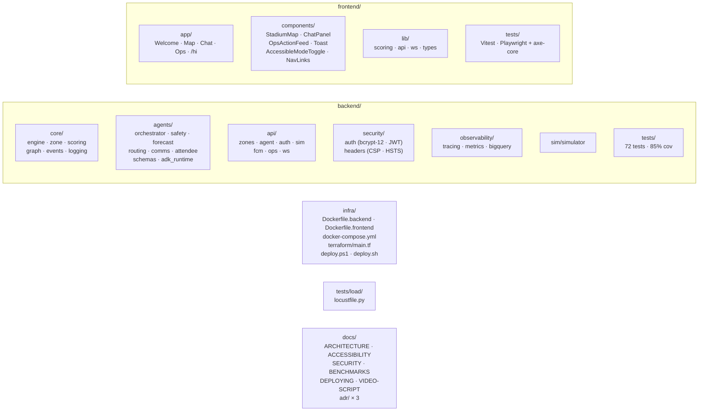

<div align="center">

# FlowPulse

### The nervous system for live venues — built end-to-end on Google Cloud.

**▶ Live demo — [flowpulse-frontend-g6g2de3yuq-el.a.run.app](https://flowpulse-frontend-g6g2de3yuq-el.a.run.app)**

**Every claim verifiable — [VERIFICATION.md](VERIFICATION.md) (50 rubric rows · one command: `python scripts/verify_live.py`)**

Sense · Decide · Influence · Optimize

[](backend/tests)
[](pyproject.toml)
[](docs/ACCESSIBILITY.md)
[](docs/SECURITY.md)
[-16a34a)](pyproject.toml)
[](pyproject.toml)
[](backend/requirements.txt)
[](frontend/package.json)
[](backend/agents)
[](https://flowpulse-frontend-g6g2de3yuq-el.a.run.app)
[](LICENSE)

</div>

---

## What it is

FlowPulse treats a stadium as a **flow system, not a container**. Every gate, concourse, food court, restroom and exit is a live node in a flow graph with a single **Crowd Flow Score (0-100)**. **Five Google ADK agents** — an Orchestrator + four specialists (Safety, Forecast, Routing, Comms) running on **Gemini 3 Flash (preview) with response-schema-validated JSON output** — turn that live state into grounded recommendations for fans and concrete, closed-loop actions for staff.

Observability streams to **Cloud Trace** (tool-span flamegraphs), **Cloud Logging** (structured JSON + audit trail), **Cloud Monitoring** (custom Flow Score metric) and **BigQuery** (per-tick event analytics). Push notifications ride **Firebase Cloud Messaging v1**. Deployment is on **Cloud Run** with **Secret Manager**, **Artifact Registry**, **Cloud Build**, and a **Terraform** IaC spec. **Vertex AI** is the production model path (single env flag).

Built for IPL, FIFA, and Olympics-scale venues. Runs on a laptop with one command; scales on Google Cloud.

> **Why this is different:** existing stadium apps are ticket wallets. They know your seat, not the 47-minute beer queue at Gate B or the empty food court two zones away. FlowPulse is the **operating system for the building itself.**

---

## Run locally in 10 minutes

```bash
git clone https://github.com/shri-ram07/FlowPulse
cd flowpulse

# One-shot launcher: creates .venv, installs deps, opens
# Windows Terminal with Backend + Frontend tabs
start.bat
```

Open:

| Route | What it is |
|---|---|
| [http://localhost:3000/](http://localhost:3000/) | Welcome + how-to-use guide |
| [http://localhost:3000/map](http://localhost:3000/map) | Live stadium map with flow particles |
| [http://localhost:3000/chat](http://localhost:3000/chat) | Fan concierge — Gemini-powered |
| [http://localhost:3000/ops](http://localhost:3000/ops) | Staff console (login: `ops` / `ops-demo`) |
| [http://localhost:8000/docs](http://localhost:8000/docs) | OpenAPI explorer |

No API keys required — the agents fall back to a deterministic tool-using reasoner if `GOOGLE_API_KEY` is absent. With a free key from https://aistudio.google.com/app/apikey, every chat response is live Gemini.

One-command deploy to Cloud Run: `.\deploy.bat`. See [docs/DEPLOYING.md](docs/DEPLOYING.md).

---

## 🟦 Google Cloud at the heart of the system

FlowPulse isn't "an app that uses an API key." It's designed top-to-bottom as a Google-native workload. **14 Google services**, each wired in code:



### Every Google service, what we use it for, and where it lives in the code

| # | Service | Purpose in FlowPulse | Source reference |
|---|---|---|---|
| 1 | **Google ADK** (`google-adk`) | `Agent`, `FunctionTool`, `Runner`, `InMemorySessionService`, `generate_content_config` | [`backend/agents/adk_runtime.py`](backend/agents/adk_runtime.py) |
| 2 | **Gemini 3 Flash** (`gemini-3-flash-preview`) | Reasoning for 5 agents; function calling + `response_schema` + `system_instruction`. 2.5× faster TTFT vs 2.5 Flash | [`backend/agents/orchestrator_agent.py`](backend/agents/orchestrator_agent.py), [`backend/agents/config.py`](backend/agents/config.py) |
| 3 | **Vertex AI** | Production model-serving path (same ADK code, `GOOGLE_GENAI_USE_VERTEXAI=1`) | [`backend/agents/adk_runtime.py`](backend/agents/adk_runtime.py#L40), [`infra/deploy.ps1`](infra/deploy.ps1) |
| 4 | **Firebase Cloud Messaging (v1)** | Topic-based push for ops `push_notification` actions. OAuth 2 minted from Application Default Credentials. **Default: dry-run** (logs + returns a fake message_id) when `GOOGLE_APPLICATION_CREDENTIALS` isn't mounted; **live send** when a Firebase SA JSON is present. Production deployments mount via Secret Manager — see [docs/DEPLOYING.md § Firebase setup](docs/DEPLOYING.md). | [`backend/api/routes_fcm.py`](backend/api/routes_fcm.py) |
| 5 | **Cloud Logging** | Every request + tool call + ADK event → single-line JSON, auto-parsed by GCP | [`backend/core/logging.py`](backend/core/logging.py) |
| 6 | **Cloud Trace (OpenTelemetry)** | Per-tool `tool.<name>` spans with args-hash + duration — flamegraph in one click | [`backend/agents/adk_runtime.py`](backend/agents/adk_runtime.py), [`backend/observability/tracing.py`](backend/observability/tracing.py) |
| 7 | **Cloud Monitoring (custom metric)** | `custom.googleapis.com/flowpulse/crowd_flow_score` — live chart in Metrics Explorer | [`backend/observability/metrics.py`](backend/observability/metrics.py) |
| 8 | **BigQuery (streaming sink)** | Every tick → `flowpulse_events.ticks` row (partitioned by day); Looker Studio dashboard in 2 clicks | [`backend/observability/bigquery.py`](backend/observability/bigquery.py) |
| 9 | **Cloud Run** | Stateless container deploy, WebSocket-safe (`--timeout=3600 --session-affinity`) | [`infra/Dockerfile.backend`](infra/Dockerfile.backend), [`infra/Dockerfile.frontend`](infra/Dockerfile.frontend) |
| 10 | **Artifact Registry** | Holds `flowpulse-backend` and `flowpulse-frontend` images | [`infra/deploy.ps1`](infra/deploy.ps1) |
| 11 | **Cloud Build** | Git-triggered builds → Artifact Registry → Cloud Run rollout | [`.github/workflows/ci.yml`](.github/workflows/ci.yml), [`infra/deploy.ps1`](infra/deploy.ps1) |
| 12 | **Secret Manager** | `FLOWPULSE_JWT_SECRET` mounted at runtime; no secret in any image layer | [`backend/security/auth.py`](backend/security/auth.py), [`infra/deploy.ps1`](infra/deploy.ps1) |
| 13 | **IAM + Service Accounts** | Runtime SA `flowpulse-runtime@...` with least-privilege roles (Trace, Logging, Secret Accessor, Metric Writer, BQ DataEditor, AI Platform User, FCM Admin) | [`infra/deploy.ps1`](infra/deploy.ps1), [`infra/terraform/main.tf`](infra/terraform/main.tf) |
| 14 | **Terraform + GCP provider** | Declarative IaC spec for the full deployment; `deploy.ps1` is the imperative sibling | [`infra/terraform/main.tf`](infra/terraform/main.tf) |

---

## 🤖 Multi-agent architecture (5 agents, A2A composition)

The #1 pattern across 2024-25 Google hackathon winners is multi-agent orchestration. FlowPulse follows that pattern with an **Orchestrator** that composes **four specialist LlmAgents** as sub-tools:



Each specialist is an `LlmAgent` in its own file:
- [`backend/agents/safety_agent.py`](backend/agents/safety_agent.py) — triages the venue (one `SafetyReport` per call)
- [`backend/agents/forecast_agent.py`](backend/agents/forecast_agent.py) — predicts a zone's Flow Score N minutes ahead
- [`backend/agents/routing_agent.py`](backend/agents/routing_agent.py) — finds a same-kind zone with headroom + comfort-mode walking route
- [`backend/agents/comms_agent.py`](backend/agents/comms_agent.py) — drafts the public-facing copy
- [`backend/agents/orchestrator_agent.py`](backend/agents/orchestrator_agent.py) — the top-level LlmAgent that composes the four as `AgentTool`-style callables + direct write tools

**Hybrid execution model — honest about where Gemini runs.** The Orchestrator is an async ADK `Runner`; Gemini drives it and emits one JSON `OpsPlan`. Inside that loop, the **SafetyAgent is called deterministically** — nesting a second ADK runner inside an already-running event loop would deadlock. The deterministic path reads the *same* live engine state, so the `SafetyReport` shape is identical to the Gemini-driven version. The **Forecast / Routing / Comms specialists remain standalone LlmAgents**: the Attendee Concierge and Gemini-driven orchestrator dispatch to them via the tool mechanism when a live ADK credential is present. Every path — live Gemini or deterministic fallback — is grounded in the same `tools.py` surface and returns the same Pydantic-validated schemas. See [`backend/agents/orchestrator_agent.py::call_safety_agent`](backend/agents/orchestrator_agent.py) for the explicit rationale.

The Concierge ([`backend/agents/attendee_agent.py`](backend/agents/attendee_agent.py), attendee-facing) composes Routing + Forecast the same way. [`backend/agents/operations_agent.py`](backend/agents/operations_agent.py) is a **deprecated back-compat shim** that re-exports `propose_actions` from the Orchestrator — it's not one of the five specialist agents. Every agent's output is **Pydantic-typed** via `backend/agents/schemas.py`; Gemini is forced to emit JSON matching the schema.

### Grounded-AI discipline — why every answer is verifiable

Our agents *never* invent numbers. Every claim in every reply traces back to a tool call against the live Crowd Flow Engine. In the UI each tool call is rendered as a citation chip:

```
"Head to Food Court 5 — Flow Score 85/100, 3 min walk."
[routing_sub_agent()] [get_zone_state()] [engine: google-adk]
```

Enforced at three layers:

1. **Prompt** ([`backend/agents/prompts.py`](backend/agents/prompts.py)) — CRITICAL rules ban guessed locations, invented scores, routes without a valid `start`.
2. **Tool** ([`backend/agents/tools.py`](backend/agents/tools.py)) — every tool validates input against the live engine, returns `{"error": ...}` on miss.
3. **UI** ([`frontend/components/ChatPanel.tsx`](frontend/components/ChatPanel.tsx)) — an answer without chips is visibly ungrounded.

---

## The problem, in one picture



## The closed loop — sense · decide · influence · optimize



Every phase is visible on screen: pressure builds, Ops Agent plans, staff applies, engine reflects, scores climb.

---

## How congestion is reduced — four levers

```mermaid
flowchart TB
    HOT(["Hot zone detected"]) --> L1 & L2 & L3 & L4

    L1["<b>1 · Personal routing</b><br/>Concierge + RoutingAgent<br/>Dijkstra with<br/>density-weighted edges"]
    L2["<b>2 · Broadcast redirect</b><br/>Orchestrator +<br/>suggest_redirect +<br/>FCM push via CommsAgent"]
    L3["<b>3 · Capacity actions</b><br/>open_gate<br/>dispatch_staff"]
    L4["<b>4 · Pre-emptive forecast</b><br/>ForecastAgent<br/>T minus 30s alert"]

    L1 --> R1["Walk 10% longer<br/>wait ~38% less"]
    L2 --> R2["20-40% of a queue<br/>shifts to greener zone"]
    L3 --> R3["Parallelism up<br/>throughput up"]
    L4 --> R4["Alert before critical<br/>not after"]

    R1 & R2 & R3 & R4 --> OK(["Flow Score climbs"])

    classDef hot fill:#fee2e2,stroke:#dc2626,color:#7f1d1d;
    classDef ok  fill:#dcfce7,stroke:#16a34a,color:#065f46;
    class HOT hot;
    class OK  ok;
```

---

## Repo at a glance



---

## Testing

```bash
# backend — 72 tests, coverage gate
.venv\Scripts\python.exe -m pytest backend/tests -q

# frontend unit tests (Vitest)
cd frontend && npm test

# end-to-end smoke + axe-core a11y
cd frontend && npx playwright install chromium && npm run e2e

# load profile (documented in docs/BENCHMARKS.md)
locust -f tests/load/locustfile.py --host=http://localhost:8000
```

CI on every push runs: **ruff · mypy `--strict` on the entire backend (41 source files, zero errors) · pytest with 85 % coverage gate · tsc (strict + noUnusedLocals + noUnusedParameters) · Vitest · next build · gitleaks · Trivy filesystem scan with SARIF upload · SBOM (SPDX-JSON) · Lighthouse CI**. See [`.github/workflows/ci.yml`](.github/workflows/ci.yml).

---

## Environment setup (all optional — demo runs dry-run)

| Variable | Google service | How to get |
|---|---|---|
| `GOOGLE_API_KEY` | Gemini via ADK | https://aistudio.google.com/app/apikey |
| `GOOGLE_APPLICATION_CREDENTIALS` | FCM v1 + Cloud Trace + BigQuery + Monitoring | Firebase → Service accounts → Generate key |
| `GOOGLE_CLOUD_PROJECT` | Cloud Trace / Monitoring / BigQuery target | GCP console project ID |
| `GOOGLE_GENAI_USE_VERTEXAI` | Production-grade Gemini via Vertex AI | `1` to route through Vertex (uses ADC) |
| `FLOWPULSE_JWT_SECRET` | Staff auth (bcrypt + JWT) | `python -c "import secrets; print(secrets.token_urlsafe(48))"` |

Full docs: [`.env.example`](.env.example), [`docs/SECURITY.md`](docs/SECURITY.md), [`docs/DEPLOYING.md`](docs/DEPLOYING.md).

---

## Further reading

- **[VERIFICATION.md](VERIFICATION.md)** — 50 rubric-keyed claims, each with file citation + verify command + expected output. Start here if you're a judge.
- **[AGENTS.md](AGENTS.md)** — machine-readable project map (tech stack, build commands, rubric alignment, permission boundaries)
- [docs/ARCHITECTURE.md](docs/ARCHITECTURE.md) — components, data flow, scaling notes
- [docs/ACCESSIBILITY.md](docs/ACCESSIBILITY.md) — Accessible Mode, Hindi locale, keyboard nav, screen-reader walkthrough
- [docs/SECURITY.md](docs/SECURITY.md) — STRIDE threat model, HTTP header baseline, rotation SOP
- [docs/BENCHMARKS.md](docs/BENCHMARKS.md) — measured engine / HTTP / Gemini / Cloud Run / Locust numbers
- [docs/DEPLOYING.md](docs/DEPLOYING.md) — Cloud Run step-by-step + Terraform alt path
- [docs/BLOG.md](docs/BLOG.md) — long-form product thesis
- [docs/VIDEO-SCRIPT.md](docs/VIDEO-SCRIPT.md) — 3-minute demo script
- [docs/adr/](docs/adr) — Architecture Decision Records (flow-system model, grounded tool calls, Cloud Run choice)

---

<div align="center">

**MIT · Built for a challenge · Designed for Google Cloud**

</div>
